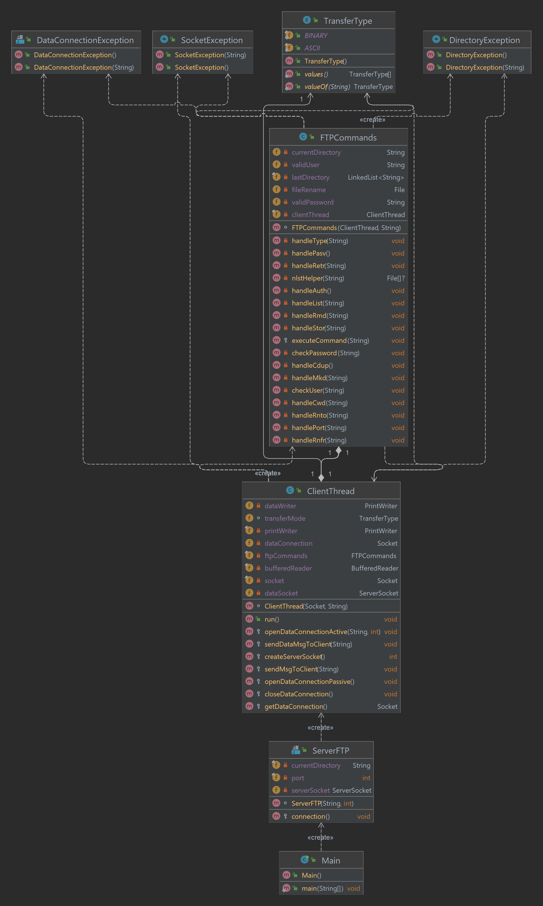

# Serveur-FTP-MICHOT-POCHET
Auteurs : *Antoine POCHET* | *Julien MICHOT* <br>
Date de commencement : 25/01/22 <br>
[Vidéo du projet](doc/Serveur-FTP-demonstration.mp4)

## Presentation du projet : 

**Serveur FTP** est un programme codé en Java qui permet de simuler un serveur FTP grâce au protocole [File Transfer Protocole](https://fr.wikipedia.org/wiki/File_Transfer_Protocol) (FTP). Le programme permet de choisir un chemin vers un répertoire qui correspondra à la racine du serveur en question.

### Différentes commandes
#### Pour générer le JAR :
```
mvn package
```

#### Pour exécuter le JAR :
```
java -jar target/Serveur-FTP-POCHET-MICHOT-1.0-SNAPSHOT.jar {path} {-p={port}}
```

Avec : 
- `{path}` chemin absolu vers le dossier d'où le serveur ftp débutera
- `-p={port}` argument facultatif permettant de choisir le port du serveur ftp (facultatif)

#### Pour générer la javadoc
```
mvn javadoc:javadoc
```

## Architecture
*UML du projet :* <br> 


### Lister et expliquer la gestion d'erreur :

Dans ce projet, il y a plusieurs Classe qui extends Exception. <br>
`DataConnectionException` : permet de relever les erreurs durant la création ou la fermeture de data socket <br>
`DirectoryException` : permet de relever les exceptions lors de la manipulation des dossiers <br>
`SocketException` : permet de relever les erreurs durant la création ou la fermeture de socket <br>

## Code samples :

On peut voir ici la partie de la connexion.
Une fois le serveur lancé, on a une boucle infinie qui attend une connexion de la part d'un client.
```
protected void connection() throws IOException {

  serverSocket = new ServerSocket(port);
  System.out.println("Server Started on port " + port + " ...");

  while (true) {
    System.out.println("Waiting for the request...");
    Socket client = serverSocket.accept();
    System.out.println("Got a client");
    System.out.println("Client Address " + client.getInetAddress().toString());

    ClientThread ct = new ClientThread(client, currentDirectory);
    ct.start();
  }
}
```

Une fois que le serveur est lancé et qu'un client s'est connecté au serveur. La classe ClientThread qui entend de Thread, permettant plusieurs connexions, on a une seconde boucle infinie permettant de lire les commandes reçues par le client et les exécuter via la classe FTPCommands.
```
@Override
public void run() {
  while (true) {

    try {
      String command = bufferedReader.readLine();
      if (command !=null) {
        ftpCommands.executeCommand(command);
      }
    } catch (IOException | SocketException | DataConnectionException | DirectoryException e) {
      e.printStackTrace();
    }
  }
}
```

La méthode suivante permet de vérfier dans un fichier (user.txt) que le nom d'utilisateur fournis par le client est bien présent dans le fichier.Par la suite on pourra assigner a `validPassword` la valeur du mot de passe correspondant au nom d'utilisateur donnée par le client pour valider la connexion lors de l'appel a `checkPassword`
```
private void checkUser(String username) throws IOException {
  Path path = Paths.get("src/main/java/sr1/user.txt");
  BufferedReader bufferedReader = Files.newBufferedReader(path);
  String line = bufferedReader.readLine();

  while (line != null){
    if (username.toLowerCase().equals(line.split(":")[0])) {
      validUser = line.split(":")[0];
      validPassword =  line.split(":")[1];
      clientThread.sendMsgToClient("331 Please specify the password.");
    }

    line = bufferedReader.readLine();
  }

  if (validUser == null){
    clientThread.sendMsgToClient("530 User KO");
  }
}
```

Cette méthode permet l'envoi de données vers le serveur ftp grace a un `BufferedInputStream` qui prends en paramètre ce que le client lui envoie grace a la data socket.
```
private void handleStor(String file) throws IOException {
  clientThread.sendMsgToClient("150 Ok to send data.");

  BufferedInputStream bufferedInputStream = new BufferedInputStream(clientThread.getDataConnection().getInputStream());

  byte[] fileBytes = bufferedInputStream.readAllBytes();

  FileOutputStream fileOutputStream = new FileOutputStream(currentDirectory + "/" + file);

  fileOutputStream.write(fileBytes, 0, fileBytes.length);

  bufferedInputStream.close();
  fileOutputStream.close();

  clientThread.sendMsgToClient("226 Directory send OK.");
}
```

Cette méthode permet, grace a la classe `File`, de retourner une liste de fichier contenu dans la destination fournie en paramètre (`args`)
```
private File[] nlstHelper(String args) {
  String filename = currentDirectory;
  if (args != null) {
    filename = filename + '/' + args;
  }

  File f = new File(filename);

  if (f.exists() && f.isDirectory()) {
    return f.listFiles();
  } else if (f.exists() && f.isFile()) {
    File[] allFiles = new File[1];
    allFiles[0] = f;
    return allFiles;
  } else {
    return null;
  }
}
```
